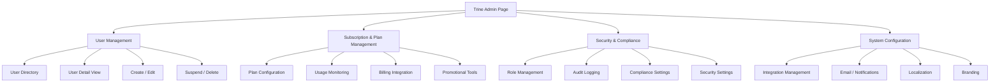
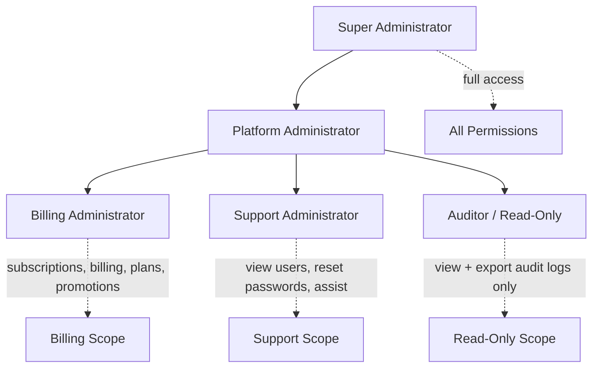
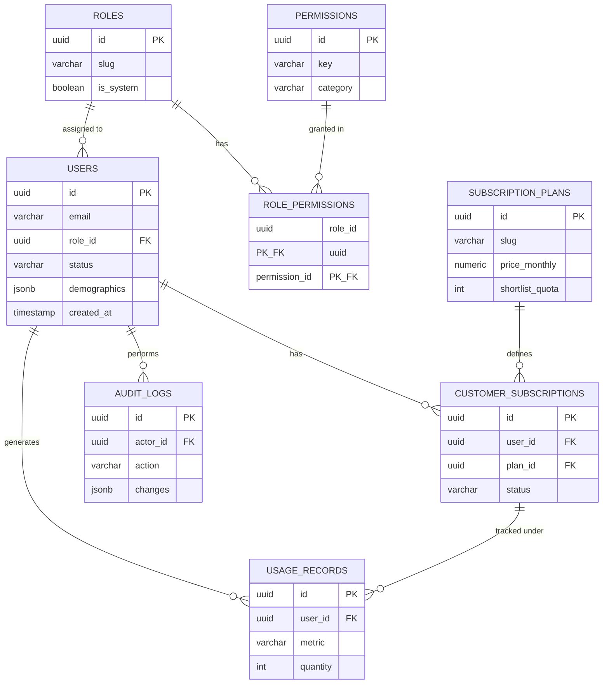
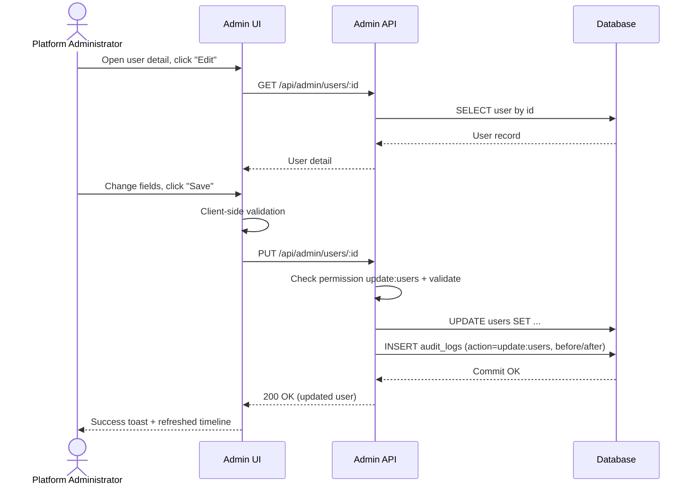

# Trine Admin Page Specifications

## Overview

The Trine Admin Page is the central control hub for operating the Trine platform — the AI shopping-decision service that turns an overwhelming field of options into three confident, reasoned choices for time-strapped consumers. It gives the internal team a single, secure surface to manage the people who use Trine, the subscription plans and billing that fund it, the AI and retailer integrations that power the shortlist engine, and the security and compliance controls that protect the sensitive financial, demographic, and personally identifiable data Trine stores. Every action is permission-gated and audit-logged, so administrators can run the business confidently while the company retains a complete, defensible record of who changed what and when.

## User Personas

### Primary User: Platform Administrator
- **Role:** Owns day-to-day operation of the Trine platform — accounts, plans, integrations, and global settings.
- **Goals:** Manage the full user lifecycle (create, edit, suspend, delete); configure and adjust subscription plans, quotas, and promotions; monitor usage (shortlists generated, AI-curation calls, retailer queries) against plan limits; configure retailer/AI/email integrations; keep the platform healthy and compliant.
- **Pain points:** Context-switching across disconnected tools; slow, manual user lookups; no clear view of who is approaching plan limits; fear of making an irreversible change without a safety net or audit trail; uncertainty about whether a setting change took effect.

### Secondary User: Support Administrator
- **Role:** Front-line customer assistance; resolves account and access issues without touching billing structure or system configuration.
- **Goals:** Quickly find a customer, view their account and subscription state, reset passwords, resend verification, clear a stuck session, and explain usage/quota questions; escalate cleanly when a change exceeds their permissions.
- **Pain points:** Over-broad tools that risk accidental destructive changes; not enough visibility into a customer's subscription/usage history to answer questions; password resets and verification resends buried in multi-step flows; no record of the help actions they performed.

## Features and Functionality

### 1. User Management
- **User Directory:** Paginated, server-side searchable/filterable data table of all accounts (filter by status, plan, role, signup date, verification state; full-text search on name/email). Bulk actions (suspend, export) behind confirmation.
- **User Detail View:** A single profile surface showing identity, contact, locale, account status, current subscription and billing state, usage this period, saved preferences (budget, brands, quality tier), recent shortlists/searches, and a per-user activity timeline sourced from the audit log.
- **Creation/Editing:** Create internal/admin accounts and edit customer profile fields (display name, email, locale, role assignment for staff). Email changes trigger re-verification.
- **Suspension/Deletion:** Reversible **suspend** (blocks login, preserves data) and a guarded **delete** that performs a soft delete with a grace window before hard deletion, honoring data-retention and right-to-erasure obligations. Both require a typed confirmation and a reason captured to the audit log.
- **Account Assistance:** Force password reset, resend verification, end active sessions, and (Super Admin only) time-boxed, logged user impersonation for troubleshooting.

### 2. Subscription and Plan Management
- **Plan Configuration:** Create/edit plans (Free, Premium, Family), each with monthly/annual pricing, shortlist quota (e.g., Free = 5/month, Premium = unlimited), member seats (Family = up to 5), feature flags, and the linked payment-processor price ID. Plans can be deactivated without breaking existing subscribers.
- **Usage Monitoring:** Dashboards and per-user views of consumption metrics — shortlists generated, AI-curation calls, retailer queries — against plan quotas, with thresholds that flag users near or over limits.
- **Billing Integration:** Two-way integration with the payment processor (e.g., Stripe). View invoices and payment status, change a customer's plan or billing cycle, issue credits/refunds (permission-gated), comp a subscription, and reconcile via webhooks. No raw card data is ever stored by Trine.
- **Promotional Tools:** Create and manage promo codes, free-trial extensions, and percentage/fixed discounts with validity windows, redemption caps, and plan eligibility.

### 3. Security and Compliance
- **Role Management:** Create and edit roles and assign granular permissions (RBAC, see below). System roles are protected from deletion.
- **Audit Logging:** Immutable, queryable log of every administrative action (actor, action, resource, before/after, IP, timestamp), with export for compliance review.
- **Compliance Settings:** Configure data-retention windows, manage data-subject access/erasure requests (GDPR/CCPA), consent records, and PII handling policies appropriate to the financial/demographic data Trine stores.
- **Security Settings:** Enforce admin MFA, session timeout and IP allowlists, password policy, and review/revoke active admin sessions and API keys.

### 4. System Configuration
- **Integration Management:** Manage retailer connectors (Amazon, eBay, Best Buy, Etsy, Macy's), the AI model/provider configuration powering curation, and the payment processor and email provider — including health status and key rotation.
- **Email/Notification Settings:** Configure transactional templates (welcome, verification, password reset, billing), notification channels, and the in-app notification policy.
- **Localization Settings:** Manage supported locales, currency display, and date/number formatting.
- **Branding Settings:** Control public-facing brand assets bound to the Trine design system (logo, gradient, theme defaults) without code changes.

## User Interface Design

### Layout
A responsive, mobile-first layout composed of four regions:
- **Left Sidebar:** Persistent primary navigation (collapsible to icons on smaller viewports; off-canvas drawer on mobile) grouping Users, Subscriptions, Security, and System Configuration, with the active item highlighted.
- **Header:** Global search, environment indicator, notifications, the light/dark theme toggle, and the admin's account menu; breadcrumbs for deep views.
- **Main Content Area:** Section workspace built from cards, data tables, detail panels, and forms; uses a max-width container with the design system's 8px spacing scale.
- **Footer:** Build/version, environment, support link, and legal/compliance links.

### Key UI Components
- **Header:** Global command/search bar, notification popover, theme toggle, account dropdown, breadcrumbs.
- **Navigation:** Collapsible sidebar with grouped nav items and icons (Heroicons), mobile drawer, and contextual tabs within sections (e.g., Subscriptions → Plans / Subscribers / Usage / Promotions).
- **Content Area:** Server-paginated **Data Tables** (sort, filter, column controls, row actions), **Stat/Cards** and number-ticker stat blocks for dashboards, **Detail Panels**, **Modals/Dialogs** for create-edit and destructive confirmations, **Forms** with inline validation and soft-glow focus, **Badges** for status, **Tabs/Accordions** for disclosure, **Toasts** for feedback, and **Skeleton/Shimmer** loaders (never spinners that imply struggle).

### Visual Design
The visual design **must follow the provided Trine Brand Identity & Design System** without deviation:
- **Color palette:** the brand gradient (`#312E81 → #4338CA → #2563EB → #0891B2 → #14B8A6 → #34D399 → #FBBF24`) for primary emphasis and active states; Blue `#2563EB` as the primary action color; neutrals (ink `#0F172A`, muted `#64748B`, light-gray `#F1F5F9`, white) for surfaces and text; and functional colors success `#16A34A`, warning `#F59E0B`, error `#DC2626`, info `#2563EB` for status.
- **Typography:** **Inter** for all UI, labels, and table/body text; **DM Serif Display** reserved for major page/section headlines. Use the defined type scale (H1 48 / H2 36 / H3 30 / Body 16 / Small 14).
- **Micro-interactions:** button hover (gentle 1.02 scale + gradient shift, 150ms ease-out), form focus (soft cyan `#0891B2` glow ring), calm shimmer/skeleton loading states, success confirmations, and slide/fade view transitions — implemented with Framer Motion and Tailwind, and honoring `prefers-reduced-motion`.
- **Theming:** light and dark modes are first-class via DaisyUI themes with system detection and a persistent toggle; dark mode leans into the deep-indigo end of the gradient. All pairings meet WCAG AA contrast.

## Database Schema

### Users Table
| Column | Type | Key / Constraints |
|---|---|---|
| id | UUID | PK, default gen_random_uuid() |
| email | VARCHAR(255) | UNIQUE, NOT NULL |
| password_hash | VARCHAR(255) | NULL (null when SSO/OAuth) |
| display_name | VARCHAR(120) | NULL |
| phone | VARCHAR(30) | NULL |
| role_id | UUID | FK → roles.id, NOT NULL |
| status | VARCHAR(20) | NOT NULL, default 'active' (active, suspended, pending, deleted) |
| email_verified | BOOLEAN | NOT NULL, default false |
| mfa_enabled | BOOLEAN | NOT NULL, default false |
| locale | VARCHAR(10) | NOT NULL, default 'en-US' |
| demographics | JSONB | NULL (encrypted at rest; sensitive PII) |
| last_login_at | TIMESTAMP | NULL |
| created_at | TIMESTAMP | NOT NULL, default now() |
| updated_at | TIMESTAMP | NOT NULL, default now() |
| deleted_at | TIMESTAMP | NULL (soft delete) |

### Roles Table
| Column | Type | Key / Constraints |
|---|---|---|
| id | UUID | PK, default gen_random_uuid() |
| name | VARCHAR(50) | NOT NULL |
| slug | VARCHAR(50) | UNIQUE, NOT NULL |
| description | TEXT | NULL |
| is_system | BOOLEAN | NOT NULL, default false (system roles undeletable) |
| created_at | TIMESTAMP | NOT NULL, default now() |
| updated_at | TIMESTAMP | NOT NULL, default now() |

### Permissions Table
| Column | Type | Key / Constraints |
|---|---|---|
| id | UUID | PK, default gen_random_uuid() |
| key | VARCHAR(100) | UNIQUE, NOT NULL (format `action:resource`) |
| category | VARCHAR(50) | NOT NULL |
| description | TEXT | NULL |
| created_at | TIMESTAMP | NOT NULL, default now() |

### Role Permissions Table
| Column | Type | Key / Constraints |
|---|---|---|
| role_id | UUID | PK (composite), FK → roles.id ON DELETE CASCADE |
| permission_id | UUID | PK (composite), FK → permissions.id ON DELETE CASCADE |
| created_at | TIMESTAMP | NOT NULL, default now() |

### Subscription Plans Table
| Column | Type | Key / Constraints |
|---|---|---|
| id | UUID | PK, default gen_random_uuid() |
| name | VARCHAR(50) | NOT NULL |
| slug | VARCHAR(50) | UNIQUE, NOT NULL (free, premium, family) |
| description | TEXT | NULL |
| price_monthly | NUMERIC(10,2) | NOT NULL, default 0 |
| price_annual | NUMERIC(10,2) | NOT NULL, default 0 |
| currency | VARCHAR(3) | NOT NULL, default 'USD' |
| shortlist_quota | INT | NULL (NULL = unlimited) |
| max_members | INT | NOT NULL, default 1 |
| features | JSONB | NOT NULL, default '{}' |
| stripe_price_id | VARCHAR(100) | NULL |
| is_active | BOOLEAN | NOT NULL, default true |
| created_at | TIMESTAMP | NOT NULL, default now() |
| updated_at | TIMESTAMP | NOT NULL, default now() |

### Customer Subscriptions Table
| Column | Type | Key / Constraints |
|---|---|---|
| id | UUID | PK, default gen_random_uuid() |
| user_id | UUID | FK → users.id ON DELETE CASCADE, NOT NULL |
| plan_id | UUID | FK → subscription_plans.id, NOT NULL |
| status | VARCHAR(20) | NOT NULL (trialing, active, past_due, canceled) |
| billing_cycle | VARCHAR(10) | NOT NULL, default 'monthly' (monthly, annual) |
| current_period_start | TIMESTAMP | NOT NULL |
| current_period_end | TIMESTAMP | NOT NULL |
| trial_ends_at | TIMESTAMP | NULL |
| canceled_at | TIMESTAMP | NULL |
| stripe_customer_id | VARCHAR(100) | NULL |
| stripe_subscription_id | VARCHAR(100) | NULL |
| created_at | TIMESTAMP | NOT NULL, default now() |
| updated_at | TIMESTAMP | NOT NULL, default now() |

### Usage Records Table
| Column | Type | Key / Constraints |
|---|---|---|
| id | UUID | PK, default gen_random_uuid() |
| user_id | UUID | FK → users.id ON DELETE CASCADE, NOT NULL |
| subscription_id | UUID | FK → customer_subscriptions.id, NULL |
| metric | VARCHAR(50) | NOT NULL (shortlist_generated, ai_curation_call, retailer_query) |
| quantity | INT | NOT NULL, default 1 |
| period_start | TIMESTAMP | NOT NULL (billing-period bucket) |
| period_end | TIMESTAMP | NOT NULL |
| metadata | JSONB | NULL |
| created_at | TIMESTAMP | NOT NULL, default now() |

### Audit Logs Table
| Column | Type | Key / Constraints |
|---|---|---|
| id | UUID | PK, default gen_random_uuid() |
| actor_id | UUID | FK → users.id, NULL (null for system actions) |
| action | VARCHAR(100) | NOT NULL (e.g., `update:users`) |
| resource_type | VARCHAR(50) | NOT NULL |
| resource_id | UUID | NULL |
| changes | JSONB | NULL (before/after diff) |
| ip_address | VARCHAR(45) | NULL |
| user_agent | TEXT | NULL |
| created_at | TIMESTAMP | NOT NULL, default now() (append-only) |

## Security Roles and Permissions

### Role Hierarchy
1. **Super Administrator** — Unrestricted. Manages roles/permissions, security and compliance settings, integrations, impersonation, and all of the below. The only role that can edit other admins' roles.
2. **Platform Administrator** — Full user, subscription, plan, promotion, and system-configuration management; cannot edit roles/permissions or core security settings.
3. **Billing Administrator** — Subscriptions, plans, promotions, billing, refunds/credits, and usage; read-only on users; no system or security configuration.
4. **Support Administrator** — View users; reset passwords; resend verification; end sessions; view subscriptions/usage to assist customers; no plan/billing edits, no deletes, no configuration.
5. **Auditor (Read-Only)** — View-only across dashboards, users, subscriptions, and the audit log, plus audit-log export; no write access anywhere.

### Permission Categories
**User Management:** `view:users`, `create:users`, `update:users`, `suspend:users`, `delete:users`, `reset:user_password`, `impersonate:users`

**Subscription Management:** `view:subscriptions`, `manage:subscriptions`, `view:plans`, `manage:plans`, `manage:promotions`, `view:billing`, `manage:billing`, `view:usage`

**Security & Compliance:** `view:roles`, `manage:roles`, `view:permissions`, `manage:permissions`, `view:audit_logs`, `export:audit_logs`, `manage:compliance`, `manage:security_settings`

**System Configuration:** `view:settings`, `manage:integrations`, `manage:notifications`, `manage:localization`, `manage:branding`

## API Endpoints

All endpoints are namespaced under `/api/admin`, require an authenticated admin session (JWT/bearer) plus the relevant permission, and write to the audit log on mutation.

### User Management Endpoints
- `GET /api/admin/users` — list/search/filter (paginated)
- `GET /api/admin/users/:id` — full detail
- `POST /api/admin/users` — create
- `PUT /api/admin/users/:id` — update
- `DELETE /api/admin/users/:id` — soft delete
- `POST /api/admin/users/:id/suspend` — suspend / reinstate
- `POST /api/admin/users/:id/reset-password` — force reset
- `POST /api/admin/users/:id/impersonate` — start logged impersonation (Super Admin)

### Role Management Endpoints
- `GET /api/admin/roles` — list roles
- `POST /api/admin/roles` — create role
- `PUT /api/admin/roles/:id` — update role
- `DELETE /api/admin/roles/:id` — delete (non-system)
- `GET /api/admin/permissions` — list permission catalog
- `PUT /api/admin/roles/:id/permissions` — set a role's permissions

### Subscription Management Endpoints
- `GET /api/admin/plans` — list plans
- `POST /api/admin/plans` — create plan
- `PUT /api/admin/plans/:id` — update / deactivate plan
- `GET /api/admin/subscriptions` — list subscriptions
- `GET /api/admin/subscriptions/:id` — subscription detail
- `PUT /api/admin/subscriptions/:id` — change plan / cycle / comp
- `POST /api/admin/subscriptions/:id/cancel` — cancel
- `GET /api/admin/usage` — usage metrics (filterable by user/metric/period)
- `GET /api/admin/promotions` — list promo codes
- `POST /api/admin/promotions` — create promo code

### System Configuration Endpoints
- `GET /api/admin/settings` — read global settings
- `PUT /api/admin/settings` — update global settings
- `GET /api/admin/integrations` — list integrations + health
- `POST /api/admin/integrations` — connect integration
- `PUT /api/admin/integrations/:id` — update / rotate keys
- `DELETE /api/admin/integrations/:id` — disconnect
- `PUT /api/admin/settings/notifications` — notification/email templates
- `PUT /api/admin/settings/localization` — locales/currency/formats
- `PUT /api/admin/settings/branding` — brand assets/theme defaults

### Audit and Security Endpoints
- `GET /api/admin/audit-logs` — query audit log (paginated, filterable)
- `GET /api/admin/audit-logs/export` — export (CSV/JSON)
- `GET /api/admin/security-settings` — read security config
- `PUT /api/admin/security-settings` — update MFA/session/IP policy

## User Flows

### User Management Flow
1. Admin opens **Users** from the sidebar; the directory loads a server-paginated table.
2. Admin searches by email/name or filters by status/plan; selects a user to open the **Detail View**.
3. Admin clicks **Edit**, changes fields in a modal/panel; client- and server-side validation run.
4. On **Save**, the API persists changes, writes a before/after entry to the audit log, and returns success.
5. A success toast confirms; the timeline updates. For **Suspend/Delete**, a confirmation dialog requires a typed confirmation and reason before the guarded action proceeds.

### Subscription Management Flow
1. Admin opens **Subscriptions → Subscribers** and locates the customer (or arrives from the user Detail View).
2. Admin reviews current plan, cycle, billing status, and usage-vs-quota.
3. Admin selects **Change Plan** (or comp/extend trial), choosing the new plan and cycle; the UI previews proration/effective date.
4. On confirm, the API updates the subscription, syncs with the payment processor, records the change in the audit log, and emits the relevant customer notification.
5. The subscription state and usage caps update in place; a toast confirms.

### Role and Permission Management Flow
1. A Super Administrator opens **Security → Roles**.
2. They create a new role (name, description) or select an existing non-system role.
3. In the permission matrix, they toggle permissions grouped by category (`action:resource`).
4. On **Save**, the API replaces the role's permission set, logs the change, and invalidates affected admin sessions' cached permissions.
5. Assigned admins receive the updated capabilities on their next request; the change appears in the audit log.

## Error Handling
- **Form validation:** Inline, real-time field validation with clear, plainly-worded messages in the brand voice; server-side validation mirrors client rules and is authoritative.
- **Confirmation dialogs for destructive actions:** Suspend, delete, refund, plan deactivation, and impersonation require explicit confirmation (typed confirmation + reason for the most destructive).
- **Optimistic-with-rollback / idempotency:** Mutations use idempotency keys; failed writes roll back UI state and surface a non-blaming error toast with a retry.
- **Permission & auth errors:** `401`/`403` route to a clear "insufficient permission" state with an escalation path; expired sessions prompt re-auth without data loss.
- **Integration failures:** Payment/retailer/AI integration errors are caught, surfaced with status, and retried via webhooks/queues; partial failures never leave silent inconsistencies.
- **Activity logging:** Every mutation (and every failed destructive attempt) is written to the audit log for traceability.

## Accessibility Considerations
- **WCAG 2.1 AA** conformance across all admin views; text/background contrast ≥ 4.5:1 (3:1 for large text).
- **Keyboard navigation:** Full operability without a mouse — logical tab order, skip links, focus-trapped modals, and keyboard-actionable table rows and menus.
- **Screen-reader support:** Semantic HTML, ARIA roles/labels, and ARIA live regions for async updates (table loads, toasts, validation, real-time metrics).
- **Visible focus indicators:** Persistent, high-contrast focus rings (brand cyan) on every interactive element.
- **Reduced motion:** Honor `prefers-reduced-motion`, dampening transitions and disabling non-essential animation.
- **Forms:** Programmatically associated labels, descriptive errors tied to fields via `aria-describedby`, and status announcements.

## Implementation Notes
- **RBAC enforcement:** Enforce permissions server-side on every endpoint (middleware that checks `action:resource` against the actor's role), not just in the UI; cache role→permission maps and invalidate on role changes.
- **Rendering:** Use server-side rendering / server components for the authenticated shell and data-heavy tables (fast first paint, smaller client bundles), with client components for interactive widgets; paginate and filter server-side.
- **Real-time updates:** Use WebSockets (or SSE) to push live usage metrics, integration health, and audit-feed updates to dashboards without polling.
- **Data protection:** Encrypt PII/financial/demographic fields at rest, never store raw card data (delegate to the payment processor), and gate sensitive reads behind permissions; soft-delete with a retention window before hard deletion.
- **Auditability:** Treat the audit log as append-only/immutable; capture actor, IP, user-agent, and before/after diffs on every mutation.
- **Integrations:** Abstract retailer/AI/payment/email providers behind interfaces; reconcile billing via signed webhooks with idempotent handlers; support key rotation without downtime.
- **Theming:** Implement light/dark via DaisyUI themes bound to the brand tokens; share the design-system token source with the marketing app for consistency.

## Mermaid Diagrams

### Admin Page Structure

### User Role Hierarchy

### Database Relationship Diagram

### User Management Flow

